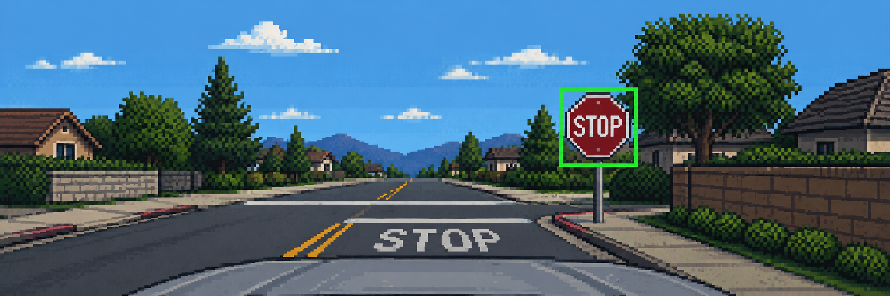

# Traffic Sign Detection & Classification with Robustness Analysis



> **Status:** early scaffolding — this README describes the intended structure and workflow. Sections marked `TBD` will be filled in as decisions are actually made and results actually exist. Don't take numbers/claims below as final; there aren't any yet.

## Overview

This project implements a full computer vision pipeline for detecting and classifying traffic signs in driving-scene images, using the [GTSDB (German Traffic Sign Detection Benchmark)](https://benchmark.ini.rub.de/gtsdb_news.html) dataset. Beyond training a detector, the project systematically evaluates how detection/classification performance degrades under realistic imaging conditions (blur, low light, noise, compression, low resolution), and tests whether training on degradation-augmented data improves robustness.

## Project Goals

- [ ] Train a lightweight object detector (YOLOv8n/s) on GTSDB to localize and classify traffic signs
- [ ] Build a standalone, tested image degradation library simulating realistic driving-condition artifacts
- [ ] Quantify how detection/classification performance changes under each degradation type and severity level
- [ ] Compare a baseline model against a model retrained on degradation-augmented data
- [ ] *(Stretch)* Deploy the trained model to embedded hardware (Raspberry Pi + camera) and measure real inference performance


## Repository Structure

```
traffic-sign-perception/
├── configs/          # experiment configs (YAML) — TBD, populated as experiments are defined
├── src/
│   ├── data/          # GTSDB → YOLO conversion, dataset splitting
│   ├── degrade/        # image degradation library (blur, noise, contrast, JPEG, resolution)
│   ├── eval/            # metrics, confusion matrix, failure case analysis
│   ├── train.py
│   └── infer.py
├── deploy/            # embedded/deployment code (stretch goal, Phase 8)
├── tests/             # pytest suite
├── scripts/           # CLI entrypoints
├── notebooks/          # exploratory visualization only — no pipeline logic lives here
├── docs/               # dataset notes, robustness findings, working notes
├── banner/              # README banner image
├── reports/            # generated plots and final writeup
├── requirements.txt
└── README.md
```

## Setup

> TBD once dependencies are pinned in Phase 0.

```bash
git clone <repo-url>
cd traffic-sign-perception
python3.11 -m venv venv
source venv/bin/activate   # or venv\Scripts\activate on Windows
pip install -r requirements.txt
```

## Dataset

The project uses GTSDB, obtained from the official [Institut für Neuroinformatik, Ruhr-Universität Bochum](https://benchmark.ini.rub.de/gtsdb_news.html) benchmark page. Raw data is **not** checked into this repository — see `docs/dataset_notes.md` (TBD) for acquisition and format notes, and run the conversion script below to regenerate the processed dataset locally.

```bash
# TBD — exact commands once conversion scripts exist
python scripts/download_and_convert_gtsdb.py
python scripts/make_splits.py
```

Class taxonomy decision (full GTSDB class set vs. grouped superclasses): **TBD**, see `docs/dataset_notes.md` once written.

## Usage

> All commands below are placeholders until the corresponding scripts exist — see `roadmap.md` for what's implemented at each phase.

**Train the baseline model:**
```bash
python src/train.py --config configs/baseline.yaml
```

**Evaluate a trained model:**
```bash
python src/eval/run_eval.py --weights <path_to_weights> --config configs/eval.yaml
```

**Generate the degraded test suite:**
```bash
python scripts/generate_degraded_testset.py
```

**Run robustness evaluation across all degradation types/severities:**
```bash
python scripts/run_robustness_eval.py
```

## Methodology (summary)

1. **Baseline training** — fine-tune YOLOv8n on GTSDB, evaluate with standard detection metrics (mAP@0.5, mAP@0.5:0.95, per-class precision/recall).
2. **Robustness evaluation** — apply controlled degradations (blur, brightness/contrast shift, noise, JPEG compression, resolution reduction) at multiple severity levels to the test set, and measure how each metric changes.
3. **Augmented retraining** — retrain on a degradation-augmented training set, repeat the robustness evaluation, and compare against the baseline.
4. *(Stretch)* **Deployment** — export to ONNX, run on Raspberry Pi 5 + Hailo AI HAT+, measure real-world latency/FPS.

Full methodology and findings will be written up in `reports/` and `docs/robustness_findings.md` as the project progresses.

## Results

**TBD.** No results exist yet — this section will contain the baseline metrics table, robustness curves per degradation type, and the baseline-vs-augmented comparison once Phases 3–7 are complete.

## Testing

The degradation library (`src/degrade/`) and dataset conversion logic (`src/data/`) have unit tests under `tests/`, run with:

```bash
pytest tests/
```

## Hardware Notes

Baseline training is done on CPU (no GPU acceleration used — see `architecture.md` §6 for the reasoning behind this decision given a small dataset and transfer learning from COCO-pretrained weights). Deployment (stretch goal) targets a Raspberry Pi 5 with a Hailo AI HAT+ for on-device NPU inference.

## Limitations & Future Work

**TBD.** Will be filled in honestly once real experiments produce real limitations — this section is intentionally not written yet rather than filled with generic placeholders.

## Acknowledgments

- GTSDB dataset: Institut für Neuroinformatik, Ruhr-Universität Bochum
- Detection framework: [Ultralytics YOLOv8](https://github.com/ultralytics/ultralytics)
- Supervised by: *TBD*
